# Methodology

> ⚡️ **Summary:**  
> This methodology outlines a machine learning–integrated generative design framework tailored to energy-efficient architecture. It combines parametric modeling, energy simulation, surrogate modeling, and designer-in-the-loop feedback to optimize early-stage building performance in line with Passivhaus and Net Zero standards.

---

## 📑 Table of Contents

1. [Research Approach](#1-research-approach)  
2. [Data Sources & Processing](#2-data-sources-and-processing)  
3. [Machine Learning Methods](#3-machine-learning-methods)  
4. [Generative Design Workflow](#4-generative-design-workflow)  
5. [Energy Simulation Integration](#5-energy-simulation-integration)  
6. [Software Tools & Dissemination](#6-software-tools-User-Experience-&-dissemination)  
7. [Challenges & Assumptions](#7-challenges-and-assumptions)  
8. [Future Work](#8-future-work)  
9. [Ethical & Sustainability Considerations](#9-ethical-and-sustainability-considerations)  
10. [Interdisciplinary Collaboration](#10-interdisciplinary-collaboration)  
11. [Documentation & Reporting](#11-documentation-and-reporting)  
12. [References](#references)

## 1. Research Approach

This methodology is specifically tailored for the early-stage design and optimization of new high-performance building projects. It extends prior ML–generative design frameworks by embedding Passivhaus and Net Zero principles at the conceptual stage, with a focus on new builds where design flexibility, data quality, and regulatory alignment are maximized. The approach prioritizes energy performance and occupant comfort through an iterative, data-driven feedback loop, leveraging the standardized data and construction practices typical of new construction.

Unlike previous approaches, this integration emphasizes automation and predictive analytics at the early-stage decision-making level, targeting new builds that seek Passivhaus certification and Net Zero energy performance. By focusing on new construction, the methodology ensures that all predictive modeling, simulation, and optimization steps are based on current best practices, modern materials, and up-to-date regulatory requirements.

This research addresses a critical gap by unifying early-stage generative design with continuous ML-predicted energy feedback for new buildings, enabling compliance with Passivhaus and Net Zero standards from the outset—an integration not extensively realized in current architectural design pipelines for new construction.

This methodology incorporates **explainable AI (XAI)**, **multi-criteria decision analysis (MCDA)**, and **equity auditing** to ensure transparency, stakeholder alignment, and social responsibility across new build typologies. The pipeline is cloud-ready, scalable, and designed for continuous improvement via **human-in-the-loop active learning** and **real-time IoT data integration** from new build pilot projects.

- **Predictive Modeling:** Machine learning techniques predict building energy use and occupant comfort based on early design parameters such as geometry, orientation, and material specifications, all derived from BIM models typical of new construction (Ascione et al., 2017; Goodfellow et al., 2016).  
- **Generative Optimization:** Genetic algorithms iteratively explore the design space for new builds, optimizing layouts, envelope performance, and renewable integration for energy efficiency and comfort, guided by simulation feedback and ML predictions (Mitchell, 1998; Bendsøe & Sigmund, 2003).  
- The integration of Passivhaus principles (airtightness, insulation, ventilation) and Net Zero targets is specifically adapted to new build scenarios, providing a robust framework that ensures designs meet stringent energy and sustainability goals from the outset (Passivhaus Trust, 2024; UK Government, 2021).

### Industry Integration & Scalability

- **Pilot Projects:** The methodology includes a framework for conducting pilot implementations with architectural firms, focusing on collecting real-world feedback and measuring practical performance gains.  
- **Scalability Assessment:** Protocols are established to assess how the methodology scales from individual building designs to neighborhood or district-level applications, addressing computational and data management challenges.  
- **Economic Impact Evaluation:** Economic assessment frameworks are integrated to quantify the cost-benefit relationships of using this methodology compared to traditional design approaches, demonstrating its value proposition to the industry.

---

## 2. Data Sources & Processing

The project utilizes standardized, high-quality datasets specific to new-build projects to support machine learning and energy simulation tasks:

- **Building Geometry and Design Parameters:** BIM exports (e.g., Revit, IFC) from new construction projects provide accurate spatial layouts, zoning, and material specifications as defined in current design documentation (Eastman et al., 2018; Revit, 2023). Legacy or retrofit-specific data is excluded to ensure consistency and relevance to new builds. Geometric data from BIM platforms is translated into simulation-ready inputs via IFC parsers or custom Dynamo scripts, extracting relevant attributes such as surface areas, zoning, and materials for new-build-specific EnergyPlus-compatible IDF files.

- **Weather Data:** Typical meteorological year files (EPW format) for the proposed site of each new build support climate-responsive design and simulation (EnergyPlus Weather Data, 2024). Weather file formats are standardized to ensure compatibility and accuracy in energy modeling workflows.

- **Energy Simulation Outputs:** EnergyPlus or OpenStudio simulation results capture Energy Use Intensity (EUI), thermal comfort indices, and HVAC loads, based on idealized new-build assumptions and calibrated against performance benchmarks (Crawley et al., 2008).

- **Performance Benchmarks:** Passivhaus and Net Zero targets for new construction are used as validation criteria and for model calibration, including thresholds for U-values (< 0.15 W/m²K), daylight autonomy (> 90%), and embodied carbon limits where applicable (Passivhaus Trust, 2024; UK Government, 2021).

- **IoT Sensor Streams:** Where available, real-time data from recently completed new builds is used for digital twin validation and model recalibration. If live data is unavailable, simulated post-occupancy datasets or literature benchmarks provide validation proxies. Sensor networks capture occupant behavior, internal gains, and environmental variables to enhance model fidelity.

- **Equity and Bias Auditing:** Datasets are regularly audited for representation and fairness across new-build typologies (residential, educational, commercial) and urban/rural contexts. This ensures the framework inclusively supports diverse new construction scenarios and mitigates potential biases in model predictions.

**Data Pipeline and Model Training Enhancements:**

- **Active Learning:** The framework employs uncertainty sampling to identify the most informative new-build design cases for prioritized learning, improving model efficiency and accuracy over time.

- **Transfer Learning:** External new-build datasets (e.g., open data from UK or EU new construction projects) are incorporated to enhance model generalization across geographic and typological variations.

- **Input Variability and Uncertainty Handling:** Variations in occupancy schedules, weather profiles, and design options are modeled using stochastic sampling and Monte Carlo simulation techniques to support robust and reliable predictions across a wide range of new-build scenarios.

### 2.1 Data Preprocessing and Feature Engineering

- **Bias Detection and Mitigation:** Protocols focus on identifying and addressing underperformance or skewed model outcomes for specific new-build typologies or site contexts during input processing and training stages.

- **Equity Auditing:** Systematic reviews ensure fair and inclusive outcomes across all relevant new-build categories, with adjustments made to data or model parameters to correct disparities.

- **Ethical Oversight:** All data collection, processing, and model deployment adhere to privacy laws, consent protocols, and responsible AI guidelines, ensuring ethical standards are met throughout the project lifecycle.

- **Data Formats and Management:** Most data is tabular or spatial-temporal, using formats such as CSV, JSON, and IDF files. Data pipelines are designed for reproducibility, scalability, and interoperability with downstream simulation and machine learning workflows.

---

## 🔄 Data Flow Diagram

⚠️ Note: If diagrams do not render on GitHub, use [Mermaid Live Editor](https://mermaid.live/edit) or export as SVG.

### 2.2 Feature Engineering Techniques.

Effective preprocessing is critical to ensure model accuracy and interpretability:

- **Data Cleaning:** Handling missing values and correcting inconsistencies in geometry and simulation outputs (Kotsiantis et al., 2006).  
- **Normalization and Scaling:** Standardizing numerical features such as floor areas, orientations, and weather variables (Goodfellow et al., 2016).  
- **Feature Extraction:** Deriving relevant features like window-to-wall ratio, building compactness, solar exposure angles, and thermal mass indicators (Li et al., 2019).  
- **Categorical Encoding:** Converting categorical design variables (e.g., construction type, HVAC system) into numerical formats suitable for ML models (Zhang et al., 2020).  
- **Temporal Aggregation:** Summarizing hourly or daily weather or energy data into meaningful statistics (e.g., monthly averages, peak loads).  
- **Dimensionality Reduction:** Applying Principal Component Analysis (PCA) if feature space becomes large or highly correlated (Jolliffe & Cadima, 2016).  

---

### 📊 Data Flow Summary Table

| **Stage**          | **Type**                 | **Format**       | **Description**                                                               |
|--------------------|--------------------------|------------------|-------------------------------------------------------------------------------|
| **Input**          | Building Geometry        | JSON, DXF, IFC   | Parametric models or predefined layouts; includes floor area, WWR, zoning      |
|                    | Climate / Weather Data   | EPW              | Hourly weather profiles: temperature, radiation, humidity                      |
|                    | Construction Benchmarks  | CSV, JSON        | U-values, infiltration rates, HVAC presets from Passivhaus datasets            |
|                    | IoT Sensor Streams       | JSON, CSV        | Real-time data from built projects for digital twin validation                 |
|                    | Equity Auditing Data     | CSV, JSON        | Demographic, typology, and usage data for bias and fairness assessment         |
| **Transformation** | Feature Extraction       | Tabular          | Derives ratios, materials, orientations, envelope metrics                      |
|                    | Data Cleaning & Encoding | Tabular          | One-hot encoding for categories; normalization for numeric data                |
|                    | Simulation Configuration | IDF (EnergyPlus) | Translated inputs used for energy and comfort simulations                      |
| **Output**         | Simulation Results       | CSV, SQLite      | Outputs include EUI, daylight autonomy, overheating hours                      |
|                    | ML-ready Feature Sets    | CSV, Parquet     | Cleaned and structured datasets for training and evaluation                    |
|                    | Digital Twin Feedback    | JSON, CSV        | IoT-driven post-occupancy data for model recalibration and validation          |
|                    | Equity Audit Reports     | PDF, CSV         | Reports on model fairness and bias detection                                   |

---

## 3. Machine Learning Methods

### Overview  
The machine learning framework is purpose-built for new-build construction projects, leveraging standardized, high-quality data and the inherent design flexibility of contemporary architecture. By training and validating exclusively on new-build datasets, the models deliver robust, relevant predictions aligned with current industry practices and regulatory benchmarks.

### Model Selection and Justification

- **Models Employed:**  
  - **Linear Regression** and **Random Forest:** Employed for baseline regression tasks, these models offer interpretability and clear insight into influential design parameters (Breiman, 2001).  
  - **Neural Networks (TensorFlow/Keras):** Used to model complex, nonlinear interactions within energy use, thermal comfort, and HVAC load data typical of new builds (Goodfellow et al., 2016).  
  - **Ensemble Stacking:** Combines predictions from multiple models to improve accuracy and robustness specifically in the new-build context.

- **Rationale:**  
  - The uniformity and completeness of new-build BIM and simulation data enable reliable training and validation.  
  - Feature importance analysis provides actionable insights, empowering iterative design adjustments.

### Learning Approaches

- **Supervised Learning:**  
  Core approach for predicting key performance indicators such as Energy Use Intensity (EUI), occupant comfort, and compliance with Net Zero standards from early-stage design inputs.

- **Active Learning:**  
  Employs uncertainty sampling to identify and prioritize the most informative new-build cases for simulation and data enrichment, accelerating model convergence and reducing computational cost.

- **Transfer Learning:**  
  Integrates external new-build datasets (e.g., open data from UK/EU projects) to enhance generalization and robustness across diverse new construction scenarios.

### Training Protocol

- Data partitioning into training, validation, and test sets exclusively from new-build cases to avoid data leakage.  
- Hyperparameter tuning and cross-validation employed to optimize model performance (Kohavi, 1995).  
- **Automated Hyperparameter Optimization:** Bayesian methods via Optuna or Hyperopt tune both ML model and genetic algorithm parameters, focusing on new-build performance metrics.  
- EnergyPlus/OpenStudio simulation outputs serve as a trusted baseline, facilitating quantification of added value through ML predictions.

### Input Features and Outputs

- Input features include detailed geometric parameters (e.g., envelope areas, window-to-wall ratios), material properties (U-values, thermal mass), climate data (weather variables), occupancy schedules, and system specifications (HVAC and renewables).  
- Outputs target key design KPIs such as annual Energy Use Intensity (kWh/m²·yr), thermal comfort indices (PMV/PPD), peak loads, and lifecycle carbon metrics.

### Evaluation Metrics

- Standard regression metrics including **Mean Absolute Error (MAE)**, **Root Mean Squared Error (RMSE)**, and **Coefficient of Determination (R²)**, assessed in the context of new-build performance targets (Willmott & Matsuura, 2005).  
- Additional validation against Passivhaus and Net Zero benchmarks ensures alignment with high-performance building standards.

### Interpretability and Explainability

- Implementation of Explainable AI (XAI) tools such as **SHAP** and **LIME** elucidates model decision-making processes, critical for user trust and actionable feedback.  
- Detailed feature importance reporting highlights key new-build design drivers, including envelope U-values, window-to-wall ratios, and renewable system sizing.

### Uncertainty Quantification

- Bayesian inference techniques and Monte Carlo dropout provide probabilistic confidence intervals, supporting risk-aware decision-making in early design phases.

### Ethics, Bias, and Equity

- **Fairness Auditing:**  
  Routine audits detect and mitigate biases related to typology (residential, educational, commercial) and site context (urban/rural).  
- **Bias Mitigation:**  
  Targeted data augmentation and model recalibration address identified inequities, ensuring inclusive recommendations across diverse new-build scenarios.

### Continuous Improvement

- **Model Updating:**  
  The system is architected for ongoing refinement, incorporating new post-occupancy data and digital twin feedback from completed projects to sustain accuracy and industry relevance.

---

### 🔁 Model Lifecycle Diagram

## 4. Generative Design Workflow

This section outlines the generative design process, specifically adapted for new-build projects. The workflow leverages the design flexibility and standardized data available in new construction, enabling robust optimization and automation of high-performance building layouts.

- **Algorithm:** 
  - Genetic Algorithms (GAs) implemented via the DEAP library (Fortin et al., 2012).
  - Rationale: GAs are well-suited for exploring the large, multi-dimensional design space typical of new builds, where form, orientation, and envelope specifications can be freely optimized.

- **Design Encoding:** 
  - Parameters represent building layouts, including room sizes, orientations, spatial adjacencies, and envelope specifications (Mitchell, 1998).  
  - Layouts are parameterized using:
    - **Bounding boxes** for spaces
    - **Adjacency matrices** to enforce connectivity rules
    - **Spline-based controls** for flexible envelope geometry adaptation
  - Rationale: New-build projects allow full control over these parameters, enabling more effective optimization compared to retrofits.

- **Optimization:**  
  - Multi-objective GA balances trade-offs between energy use, thermal comfort, and compliance with Passivhaus and Net Zero standards for new construction. 
  - Rationale: Focusing on new builds ensures that all design variables are within the architect’s control, maximizing the potential for energy and comfort optimization.

- **Simulation-ML Feedback:**
  - Each candidate design is evaluated using EnergyPlus or OpenStudio simulations, with results used to train and validate ML models. 
  - ML predictions guide the GA’s selection and mutation of designs, accelerating the search for optimal solutions.  
  - Rationale: New-build data allows for consistent, high-quality simulation and ML feedback, improving the reliability of design recommendations.

- **Iterative Refinement:**
  - The workflow iteratively refines designs based on simulation and ML feedback, with each cycle improving energy performance and comfort.
  - Rationale: The iterative process is more effective in new builds, where design changes can be implemented without legacy constraints.

- **Scenario Testing:**
  - Designs are tested against multiple future climate, regulatory, and market scenarios to ensure robustness and adaptability.
  - Rationale: New-build projects must be resilient to future changes, making scenario testing essential.

- **Outcome:**
  - The workflow produces a set of Pareto-optimal new-build designs that balance energy efficiency, comfort, and regulatory compliance.
  - Rationale: This ensures that the methodology supports architects in making informed, evidence-based decisions for high-performance new construction.

### 🧬 Generative Design and Simulation Loop

## 5. Energy Simulation Integration

This section details the integration of energy simulation into the design and optimization workflow, with all processes and assumptions tailored specifically for new-build construction projects.

### Simulation Engine Selection

EnergyPlus, accessed through the OpenStudio interface, serves as the primary simulation engine due to its industry-standard status and comprehensive, validated modeling capabilities. EnergyPlus’s detailed physics-based simulation accurately captures building thermal dynamics, HVAC system performance, and renewable energy generation potential, making it particularly well-suited for modeling high-performance new-build projects targeting Passivhaus and Net Zero certifications.

### Model Preparation and Input Generation

Building geometry, zoning, and material specifications are directly exported from high-quality, standardized BIM models such as Revit or IFC formats for each new-build project. Custom-developed scripts convert BIM data into EnergyPlus IDF input files, ensuring consistency and reducing manual setup errors. This streamlined data pipeline leverages the inherent standardization and completeness of new-build BIM data, facilitating reliable simulation input preparation and reducing setup time.

### Simulation Assumptions

All simulations assume modern construction standards, including up-to-date insulation, airtightness, and HVAC systems as specified in the design. Occupancy schedules, internal heat gains, and equipment loads follow current best-practice guidelines specifically calibrated for new construction. This ensures that simulation outputs realistically represent expected performance under typical new-build operating conditions and support valid benchmarking.

### Simulation Outputs and Benchmarking

Simulations produce key performance indicators, including annual Energy Use Intensity (EUI), thermal comfort hours (based on Predicted Mean Vote and overheating risk assessments), and potential for renewable energy generation. Results are benchmarked against stringent Passivhaus and Net Zero standards, such as envelope U-values below 0.15 W/m²K, maximum allowable cooling/heating loads, and achievement of daylight autonomy targets. This focus on performance metrics directly relevant to new-build high-performance standards guides design optimization towards regulatory compliance and sustainability goals.

### Integration with Generative Design and Machine Learning

Simulation results feed into the machine learning pipeline, where high-fidelity data trains, validates, and calibrates surrogate ML models. These ML models predict building performance metrics for newly generated design variants, enabling rapid evaluation within the generative design genetic algorithm loop. By retaining detailed simulations for a representative subset of designs, the system maintains prediction accuracy while dramatically reducing computational costs. This integration balances efficiency with robustness, exploiting the consistency and quality of new-build simulation data.

### Scenario and Sensitivity Analysis

To ensure design robustness, generated building models are simulated under a range of future climate scenarios, varying regulatory requirements, and market assumptions. Sensitivity analyses identify critical new-build design parameters that most influence performance outcomes, informing priority areas for optimization. This resilience testing is essential for new builds, which must maintain high performance despite uncertain future conditions over their service life.

### Validation and Continuous Improvement

Where available, simulation outputs are validated against post-occupancy performance data or digital twin measurements from completed new-build projects. Discrepancies between predicted and actual performance inform recalibration of simulation assumptions and update the ML models, closing the loop to improve long-term accuracy and industry relevance. Future workflow iterations plan to incorporate ASHRAE Guideline 14 calibration techniques (ASHRAE, 2014) for systematic simulation tuning.

### Computational Efficiency and Feedback Hierarchy

Machine learning surrogate models reduce the time per design evaluation from approximately 10–30 minutes for full simulations to under one second for predictions, enabling rapid exploration of large design spaces. Multiple performance metrics—including EUI, thermal comfort hours, daylight autonomy, and indoor CO₂ concentration—are predicted by the ML models. These are combined into a composite fitness score via a weighted hierarchy reflecting project-specific priorities (e.g., EUI weight 0.4, comfort 0.3, daylight 0.2, CO₂ 0.1), which guides the generative algorithm’s design selection process.

---

### 🔄 Energy Simulation Workflow Diagram (Mermaid)

## 6. Software Tools, User Experience & Dissemination

- **Core Software Stack:**  
  - **BIM & Geometry:** Autodesk Revit, IFC, Dynamo for parametric modeling and data extraction.  
  - **Simulation:** EnergyPlus, OpenStudio for energy and comfort simulation.  
  - **ML & Optimization:** Python (scikit-learn, TensorFlow/Keras, DEAP, Optuna/Hyperopt).  
  - **Data Processing:** Pandas, NumPy, custom scripts for feature engineering and data cleaning.  
  - **Visualization:** Power BI, Plotly, custom dashboards for interpretability and stakeholder engagement.

- **User Experience:**  
  - Modular, scriptable pipeline for integration into existing architectural workflows.  
  - GUI prototypes or Jupyter notebooks for interactive exploration and visualization.  
  - Documentation and example projects for reproducibility.

- **Dissemination:**  
  - Source code and data pipelines shared via GitHub (where licensing permits).  
  - Results disseminated through academic publications, conference presentations, and workshops with industry partners.

---

## 7. Challenges & Assumptions

This research encounters several technical and practical challenges that impact the performance, validity, and generalizability of the proposed machine learning-assisted generative design workflow. Each identified limitation is addressed with targeted mitigation strategies, grounded in best practices from simulation science and machine learning.

### 🔍 Key Challenges and Mitigation Strategies

| **Challenge**                 | **Description**                                                                 | **Potential Mitigation**                                                | **Reference**                       |
|------------------------------|---------------------------------------------------------------------------------|------------------------------------------------------------------------|-----------------------------------|
| **Data Limitations**          | Limited availability of diverse, labeled building performance datasets across varying climates and building types | Augment datasets with synthetic data generation, leverage transfer learning approaches, and expand real-world data collection efforts | Kotsiantis et al., 2006            |
| **Model Simplifications**     | Behavioral and physical simplifications inherent in building simulation models  | Integrate stochastic models to capture variability; validate model outputs against empirical data to improve fidelity                 | Andersen et al., 2014              |
| **Computational Cost**        | High computational expense from iterative simulation runs and optimization cycles | Employ parallel and distributed computing; utilize surrogate modeling and machine learning acceleration techniques                    | Zhao et al., 2017                 |
| **Simulation Assumptions**   | Static weather data and occupant behavior assumptions may limit realism         | Implement dynamic occupancy schedules and stochastic weather sampling methods such as Monte Carlo simulations                           | Mahdavi & Tahmasebi, 2016         |
| **Prediction Gaps**           | Discrepancies between early-stage ML predictions and actual post-occupancy building performance | Use ASHRAE Guideline 14 calibration procedures and incorporate feedback from post-occupancy evaluations                                  | Mahdavi & Tahmasebi, 2016; ASHRAE, 2014 |
| **Overfitting Risk**          | Risk of ML models overfitting to limited or imbalanced training datasets         | Apply regularization techniques, dropout layers, and rigorous cross-validation strategies                                              | Goodfellow et al., 2016           |
| **User Constraints**          | Automated workflows may overlook subjective criteria such as aesthetics, cost, and functional requirements | Incorporate manual review stages and designer-in-the-loop frameworks to enable overrides and iterative human feedback                   | Gerber et al., 2012               |
| **Domain Transferability**    | Potential underperformance of models when applied to unseen building typologies or climates | Conduct out-of-sample validation tests and develop ensemble models to enhance generalizability across domains                          | Zhang et al., 2020                |

---

### Additional Considerations

- **Bias and Overfitting Risk:** Since early-stage data can be sparse or imbalanced, overfitting is a critical risk—particularly with high-capacity models like **neural networks**. To mitigate this, regularization methods, dropout layers, and k-fold cross-validation are rigorously applied to enhance model robustness.

- **Realistic User Constraints:** Practical design decisions frequently depend on subjective factors—such as aesthetics, budget constraints, or policy requirements—that are difficult to quantify in purely performance-driven models. This workflow supports **manual overrides** and **designer-in-the-loop feedback integration** to ensure human expertise and preferences are effectively incorporated alongside automated optimization.

- **Simulation Calibration:** To maintain real-world relevance and improve predictive accuracy, the workflow anticipates future integration of **post-occupancy validation** and **ASHRAE Guideline 14-compliant calibration** using empirical energy consumption and indoor environment data from completed projects.

---

This balanced approach addresses both the technical challenges inherent in ML-assisted generative design and the practical realities of architectural decision-making, ensuring a robust, adaptable, and trustworthy methodology.

---

### 🧠 Challenge–Response Flowchart

---

## 8. Future Work

- **Scalability:**  
  - Expansion to district/neighborhood-scale modeling and optimization.  
  - Integration with urban energy models and city-level digital twins.

- **Retrofitting & Mixed-Use:**  
  - Adapting the framework for retrofit projects and mixed-use developments.

- **Advanced ML & Automation:**  
  - Incorporation of reinforcement learning, unsupervised clustering, and automated design space exploration.

- **Longitudinal Validation:**  
  - Ongoing collection of post-occupancy and IoT data for continuous model improvement and validation.

---

## 9. Ethical & Sustainability Considerations

- **Equity Auditing:**  
  - Regular audits to ensure fair and inclusive recommendations across new-build typologies and demographics.

- **Data Privacy:**  
  - All data collection and processing comply with GDPR and university ethical guidelines.

- **Sustainability:**  
  - The methodology is designed to maximize environmental and social benefit, supporting Net Zero and Passivhaus targets.

---

## 10. Interdisciplinary Collaboration

- Engage experts in architecture, engineering, computer science, and data science.  
- Encourage feedback from practicing architects and sustainability consultants.  
- Foster collaborative environments for co-development and knowledge sharing.  
- Engage in co-design workshops with architects and sustainability consultants to ensure practical relevance.  
- Use participatory modeling sessions to align ML-generated outcomes with real-world design values and stakeholder priorities.  
- **Academic/industry engagement mechanisms:** Knowledge co-creation will occur through workshops, interviews, and usability testing with practicing architects and energy consultants.

---

## 11. Documentation & Reporting

- Maintain clear records of data sources, code versions, and experimental results.  
- Transparently report model assumptions, limitations, and validation outcomes.  
- Use version control (Git) to track project development.  
- Adhere to FAIR data principles for dataset curation to ensure data is Findable, Accessible, Interoperable, and Reusable.  
- Use Jupyter Notebooks and Sphinx to document code, workflows, and model validation results for reproducibility and clarity.  
- **ML experiment tracking:** Incorporate tools like MLflow, Weights & Biases, or Comet.ml for experiment versioning, which is especially important for retraining loops.

---

## 11.1 Methodology Workflow Diagram

```mermaid
flowchart TD
    %% Define styles for different categories
    classDef mlStep fill:#a2d2ff,stroke:#0b3d91,stroke-width:2px,color:#000
    classDef simStep fill:#ffb4a2,stroke:#9b2226,stroke-width:2px,color:#000
    classDef humanStep fill:#caffbf,stroke:#2d6a4f,stroke-width:2px,color:#000
    classDef defaultStep fill:#f0efeb,stroke:#666,stroke-width:1px,color:#000

    %% Main flowchart nodes
    A[Start: Define Research Objectives]:::defaultStep --> B[Collect & Prepare Data]:::defaultStep
    B --> C[Machine Learning Modeling]:::mlStep
    C --> D[Generative Design Optimization]:::mlStep
    D --> E[Energy Simulation Validation]:::simStep
    E --> F{Are Performance Criteria Met?}:::simStep

    F -- Yes --> G[Finalize Design]:::humanStep
    F -- No --> H[Retrain ML Models & Refine Design]:::mlStep

    H --> D
    G --> I[Validation & Benchmarking]:::humanStep
    I --> J[Ethics & Sustainability Assessment]:::humanStep
    J --> K[Interdisciplinary Collaboration]:::humanStep
    K --> L[Document Challenges & Limitations]:::humanStep
    L --> M[Future Work & Improvements]:::humanStep
    M --> N[Project End / Next Iteration]:::defaultStep

    %% Iterative feedback loops with curved arrows
    C -- Iterative feedback --> E
    E -- Simulation results --> C
    D -- Design iterations --> E
    E -- Performance informs --> D

    %% Loop arrows styling
    linkStyle 12 stroke:#0b3d91,stroke-width:2px,stroke-dasharray:5,5
    linkStyle 13 stroke:#9b2226,stroke-width:2px,stroke-dasharray:5,5
    linkStyle 14 stroke:#0b3d91,stroke-width:2px,stroke-dasharray:5,5

    %% Vertical legend using separate flow
    subgraph LegendColumn[Legend]
        direction TB
        L1["■ ML-driven steps"]:::mlStep
        L2["■ Simulation-driven steps"]:::simStep
        L3["■ Human-in-the-loop steps"]:::humanStep
        L4["■ Other / Start & End"]:::defaultStep
        L1 --> L2 --> L3 --> L4
    end
```

## License

This methodology is shared under the Creative Commons Attribution 4.0 International (CC BY 4.0) License. You may share and adapt the material with attribution.

## How to Cite

> Author Edward, R. (2025). *Methodology: Machine Learning–Assisted Generative Design for Energy-Efficient Architecture*. GitHub. https://[github.com/yourusername/yourrep](https://github.com/rossedward-arch/ml-generative-energy-design)

# References

- Andersen, R.K., et al. (2014). *Uncertainty and variability in building energy performance simulation*. Energy and Buildings, 81, 141–151. https://doi.org/10.1016/j.enbuild.2014.05.057  
- Ascione, F., et al. (2017). Machine learning models for predicting building energy consumption: A review. *Renewable and Sustainable Energy Reviews*, 75, 1286-1299. https://doi.org/10.1016/j.rser.2016.11.214  
- Bendsøe, M.P. & Sigmund, O. (2003). *Topology Optimization: Theory, Methods, and Applications*. Springer.  
- Breiman, L. (2001). Random Forests. *Machine Learning*, 45(1), 5-32. https://doi.org/10.1023/A:1010933404324  
- Costa, A. & Shen, Z. (2015). Energy prediction accuracy and gaps in building simulation. *Building Simulation*, 8(4), 423–432. https://doi.org/10.1007/s12273-015-0234-0  
- Crawley, D.B., et al. (2008). EnergyPlus: Creating a new-generation building energy simulation program. *Energy and Buildings*, 40(1), 49–61. https://doi.org/10.1016/j.enbuild.2007.01.019  
- Eastman, C., et al. (2018). *BIM Handbook: A Guide to Building Information Modeling for Owners, Designers, Engineers, Contractors, and Facility Managers* (3rd ed.). Wiley.  
- EnergyPlus Weather Data (2024). *EnergyPlus Weather Files*. U.S. Department of Energy. Retrieved from https://energyplus.net/weather  
- eTool (2023). *Life Cycle Assessment Software for Buildings*. Retrieved from https://etoolglobal.com/  
- Fortin, F.-A., et al. (2012). DEAP: Evolutionary Algorithms Made Easy. *Journal of Machine Learning Research*, 13, 2171–2175.  
- Goodfellow, I., Bengio, Y., & Courville, A. (2016). *Deep Learning*. MIT Press.  
- Jolliffe, I.T. & Cadima, J. (2016). Principal component analysis: a review and recent developments. *Philosophical Transactions of the Royal Society A*, 374(2065), 20150202. https://doi.org/10.1098/rsta.2015.0202  
- Kohavi, R. (1995). A Study of Cross-Validation and Bootstrap for Accuracy Estimation and Model Selection. *International Joint Conference on Artificial Intelligence (IJCAI)*, 14(2), 1137–1145.  
- Kotsiantis, S.B., Zaharakis, I., & Pintelas, P. (2006). Machine learning: a review of classification and combining techniques. *Artificial Intelligence Review*, 26(3), 159–190. https://doi.org/10.1007/s10462-007-9052-3  
- Li, Z., et al. (2019). Feature extraction in building energy prediction: A review. *Sustainable Cities and Society*, 52, 101847. https://doi.org/10.1016/j.scs.2019.101847  
- Lundberg, S.M. & Lee, S.-I. (2017). A Unified Approach to Interpreting Model Predictions. *Advances in
