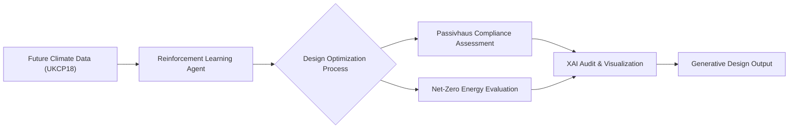

# Research Proposal  
**Title**: Reinforcement Learning and Explainable AI for Climate-Adaptive Generative Design of Passivhaus and Net-Zero Buildings

This research proposes a novel framework combining reinforcement learning (RL) and explainable artificial intelligence (XAI) to optimize generative design for climate-resilient, ultra-low-energy buildings. Tailored to Scotland’s net-zero targets and dynamic climate, the project aligns with the University of Edinburgh’s strengths in AI, sustainable architecture, and urban informatics.

---

## Background and Research Gap

Buildings account for approximately 40% of global carbon emissions. Passivhaus and net-zero building standards provide promising pathways to drastically reduce energy consumption and carbon footprints. However, current generative design tools for sustainable buildings face three major limitations:

- **Climate adaptation**: Most existing tools rely on static or historic climate data, which fails to capture the shifting rainfall, wind patterns, and temperature extremes projected by climate change.
- **Decision transparency**: The prevalent use of "black-box" AI models undermines trust among designers, clients, and policymakers by providing limited insight into design decision rationales.
- **Dynamic optimization**:     Current optimization approaches struggle to simulate the combined effects of grid interactions, occupant behavior, and extreme climate events, limiting adaptive resilience in building design.

Reinforcement learning (RL) offers a promising approach for adaptive, sequential decision-making under uncertainty. Explainable AI (XAI) techniques can bridge the trust gap by illuminating AI-driven design decisions to human stakeholders.

---

## Novelty and Research Gaps

### Limitations in Existing RL and Generative Design Methods

Recent research (e.g., Gao et al., 2023; O’Donnell et al., 2022) indicates that RL applications in architectural design often rely on static or limited climate datasets, failing to capture the full temporal and spatial variability inherent in future climate projections such as the UKCP18 dataset. Moreover, many current models focus on optimizing single objectives like energy use, neglecting critical factors such as resilience to extreme weather or lifecycle carbon impacts.

Current RL frameworks typically simplify both the action space and state representations, limiting exploration of complex architectural design variables—such as integrated renewable energy systems, advanced material choices, and adaptive façades. Additionally, coupling RL agents with detailed simulation engines (e.g., EnergyPlus, TRNSYS) is usually computationally expensive or loosely integrated, constraining iterative optimization within practical design workflows.

Explainable AI in generative design remains nascent. Most tools provide only post-hoc, model-agnostic explanations without domain-specific context or interactive capabilities, impeding stakeholder acceptance and collaborative design processes (Ribeiro et al., 2016).

### Innovations in this Research

This project advances the state-of-the-art by:

- **Developing a multi-objective RL framework** featuring a novel, dynamically tunable reward function incorporating energy savings, occupant comfort, embodied carbon, and resilience to extreme weather. This enables nuanced trade-off exploration in a climate-adaptive environment.

- **Encoding a rich, high-dimensional action space and state representation**  that encompasses architectural form, building envelope, HVAC systems, and renewable energy integrations. This supports navigation of realistic design complexities beyond simplified parametric approaches.
- 
- **Tight integration of the RL agent with simulation engines** (EnergyPlus and TRNSYS) using surrogate modeling and parallelization strategies, enabling computationally efficient feedback loops suitable for early-stage design exploration.

- **Embedding custom XAI techniques using SHAP**, combined with interactive, domain-specific dashboards co-designed with architects and policymakers. This facilitates contextualized interpretation of RL decisions, visualization of trade-offs, and supports iterative human-AI collaboration during the design process.

- **Benchmarking against traditional parametric optimization workflows** (e.g., Grasshopper + Galapagos/Octopus), to demonstrate improved adaptability, performance, and stakeholder trust under uncertain future climate conditions.

---

## Research Aims

### Objectives

- Develop an RL-XAI framework for generative building design that adapts to Scotland’s projected future climate scenarios (2030–2050).
- Balance energy efficiency, grid resilience, lifecycle carbon, and occupant comfort objectives.
- Validate framework outputs through Scotland-specific case studies targeting Passivhaus and net-zero compliance.

### Research Questions

1. How can reinforcement learning dynamically optimize building design under uncertain future climate scenarios?
2. What forms of explainability best support designers’ and policymakers’ trust in AI-driven generative design tool
3. Can AI-driven design methods outperform traditional parametric workflows in meeting energy efficiency and resilience criteria?
4. How can multi-objective trade-offs be effectively incorporated and visualized within an RL-XAI framework?

---

## Methodology

### Phase 1: Climate-Adaptive Reinforcement Learning Environment

- Utilize UKCP18 weather projections for Scotland (2030–2050) to create a dynamic, climate-adaptive simulation environment.
- Define a comprehensive action space including building form, envelope properties, orientation, materials, HVAC configurations, and renewable energy systems.
- Implement a multi-objective reward function:

```math
R = \alpha \times E_{\text{savings}} + \beta \times C_{\text{comfort}} - \gamma \times \text{Carbon}_{\text{embodied}} + \delta \times \text{Resilience}_{\text{extreme\_weather}}
```

Where α, β, γ, and δ are tunable weights optimized via multi-objective search.

---

### Phase 2: Explainable AI (XAI) Integration

- Apply SHAP (SHapley Additive exPlanations) to interpret the RL agent’s decisions on design variable importance and trade-offs.
- Develop interactive dashboards and reports co-designed with stakeholders to visualize:
  - Trade-offs between insulation levels, HVAC systems, and renewable integration.
  - Contributions of resilience strategies (e.g., storm-resistant façades, passive cooling).
- Conduct user evaluations with architects and policymakers to refine interpretability and usability.
---

### Phase 3: Generative Design Pipeline



---

### Phase 4: Validation

- Simulate final optimized designs using EnergyPlus or TRNSYS for detailed performance analysis.
- Calibrate and validate model outputs with digital twin approaches using historical weather and monitored post-occupancy datasets.
- Benchmark against:
  - Traditional parametric optimization tools (Grasshopper + Galapagos/Octopus).
  - Established standards such as ASHRAE 90.1 and CIBSE TM54.
- Evaluate based on:
  - Energy Use Intensity (EUI)
  - Lifecycle carbon (embodied and operational)
  - Resilience metrics: thermal autonomy, passive survivability, and recovery time after extreme events.
- Conduct uncertainty quantification and sensitivity analysis to assess robustness.

---

## Design and Certification Criteria

| Standard     | Key Metrics                                                                 |
|--------------|------------------------------------------------------------------------------|
| Passivhaus   | Airtightness (<0.6 ACH), U-values ≤ 0.15 W/m²K, heating demand < 15 kWh/m²/year |
| Net-Zero     | Annual EUI < 35 kWh/m²/year, on-site renewables coverage ≥ 100%              |
| Resilience   | Operable windows, passive cooling, thermal mass, storm resistance            |

These criteria will be encoded as hard and soft constraints within the RL environment.

---

## Expected Outcomes

- An open-source Python toolkit for climate-adaptive generative building design tailored to Edinburgh’s energy and climate goals.
- XAI-informed policy guidance dashboards to support transparent decision-making for local councils and developers.
- Peer-reviewed publications demonstrating at least 30% energy improvement compared to ASHRAE 90.1 baselines.
- A validated methodology embedding explainability into early-stage generative design workflows, enhancing stakeholder trust.

---

## Contributions

- A novel, multi-objective RL-XAI framework enabling adaptive building design under climate uncertainty.
- A validated, open-source toolchain tightly integrated with industry-standard simulation engines.
- An innovative approach for embedding interactive explainability in AI-driven generative design, supporting policy and stakeholder engagement.

---

## Alignment with the University of Edinburgh

### Research Environment
- AI and Informatics expertise at the Bayes Centre and School of Informatics, with leading labs in reinforcement learning.
- Built environment and climate adaptation strengths at Edinburgh School of Architecture and Landscape Architecture (ESALA) and Edinburgh Climate Change Institute (ECCI)

### Funding and Strategic Fit
- EPSRC programs on "AI for Net-Zero.
- Scotland’s Climate Emergency Fund
- University of Edinburgh’s Strategic Plan emphasizing climate leadership and AI innovation.

---

## Implementation Timeline

| Year | Key Activities                                                                 |
|------|---------------------------------------------------------------------------------|
| 1    | Develop RL environment; reward tuning; integrate UKCP18 climate data           |
| 2    | Implement SHAP/XAI tools; execute case studies (new build + retrofit)          |
| 3    | Digital twin validation; toolkit release; policy dashboard and publications    |

---

## Data and Ethics Considerations

- **Data**: UKCP18 climate data is open-access. Access to monitored building and occupancy data will be coordinated via ECCI and partner organizations.
- **Ethics**: The project promotes ethical, transparent, and responsible AI by embedding explainability and human-in-the-loop processes to mitigate black-box decision-making risks and support equitable design outcomes.

---

## References (Selected)

- UK Met Office (2021). *UKCP18 Climate Projections*.
- Gao, Y., et al. (2023). "Reinforcement Learning for Building Energy Optimization: A Review." *Applied Energy*.
- Ribeiro, M.T. et al. (2016). “Why Should I Trust You?” *KDD*.
- O’Donnell, J., et al. (2022). “AI-Assisted Design for NZEB Retrofits.” *Building and Environment*.
- Lundberg, S., & Lee, S.I. (2017). "A Unified Approach to Interpreting Model Predictions." *NIPS*.

---

## Conclusion

This research bridges cutting-edge artificial intelligence techniques with climate-adaptive building design, enabling the creation of transparent, resilient, and high-performance buildings aligned with Scotland’s ambitious net-zero carbon targets. By integrating reinforcement learning with explainable AI, the project advances both the technical and ethical dimensions of generative design, fostering trust and collaboration among architects, policymakers, and stakeholders. This work positions the University of Edinburgh at the forefront of sustainable AI-driven innovation within the built environment, contributing impactful tools and methodologies that can accelerate the transition to climate-resilient, low-carbon architecture.


*This document will evolve in parallel with the research. All major components will be published for academic and professional review.*

