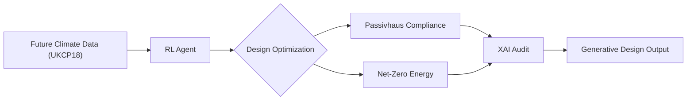

# Research Proposal  
**Title**: Integrated Reinforcement Learning and Explainable AI for Climate-Adapted Generative Design of Passivhaus and Net-Zero Buildings

This research proposes a novel framework combining reinforcement learning (RL) and explainable artificial intelligence (XAI) to optimize generative design for climate-resilient, ultra-low-energy buildings in Edinburgh. Tailored to Scotland’s net-zero targets and dynamic climate, the project aligns with the University of Edinburgh’s strengths in AI, sustainable architecture, and urban informatics.

---

## Background and Research Gap

Buildings contribute approximately 40% of global carbon emissions. Passivhaus and net-zero standards offer solutions, but generative design tools currently face three key limitations:

- **Climate adaptation**: Most tools rely on static climate data, failing to model Edinburgh’s shifting rainfall and wind patterns.
- **Decision transparency**: "Black-box" AI undermines stakeholder trust in design outcomes.
- **Dynamic optimization**: Current methods inadequately simulate the combined effects of grid interaction, occupant behavior, and extreme climate events.

Reinforcement learning enables adaptive decision-making under uncertainty, while XAI offers transparency to support stakeholder trust.

---

## Novelty and Research Gaps

### Limitations in Existing RL and Generative Design Methods

Recent studies (e.g., Gao et al., 2023; O’Donnell et al., 2022) highlight that reinforcement learning and generative design applications in architecture often use static or limited climate datasets, failing to capture the full temporal and spatial variability of future climate scenarios such as those from UKCP18. Additionally, many existing models optimize single-objective functions (e.g., energy use) without sufficiently addressing resilience or lifecycle carbon impacts.

Furthermore, current RL frameworks for building design tend to simplify the action space and state representations, limiting the exploration of complex design variables like integrated renewable systems, material choices, or adaptive façade technologies. The coupling between RL agents and detailed simulation engines (EnergyPlus, TRNSYS) is typically loose or computationally expensive, restricting iterative optimization in practical workflows.

In parallel, explainable AI techniques are still nascent in generative design. Most tools provide post-hoc model explanations without domain-specific interpretability or user interaction. This “black-box” nature impedes stakeholder acceptance, as designers, clients, and policymakers require transparent insights to trust AI-driven decisions (Ribeiro et al., 2016).

### Improvements and Innovations in this Research

This project advances the state-of-the-art by:

- **Developing a multi-objective RL framework** with a novel reward function explicitly incorporating energy savings, occupant comfort, embodied carbon, and extreme weather resilience. The reward weights are dynamically tunable, enabling exploration of trade-offs within a climate-adaptive environment.

- **Encoding a rich, high-dimensional action space and state representation** that includes architectural form, envelope characteristics, HVAC systems, and renewable integrations. This allows the RL agent to navigate realistic design complexity beyond simplified parametric models.

- **Tight integration of the RL agent with simulation engines** (EnergyPlus/TRNSYS) through optimized surrogate modeling and parallelization strategies to achieve computationally efficient feedback loops, enabling practical early-stage design exploration.

- **Custom XAI integration using SHAP combined with interactive, domain-specific dashboards** co-developed with architects and policymakers. This enables contextualized interpretation of RL decisions, visualization of trade-offs, and supports iterative human-AI collaboration during design.

- **Benchmarking against traditional parametric optimization and surrogate model workflows** (e.g., Grasshopper + Galapagos/Octopus). The RL-XAI approach aims to demonstrate improved adaptability, performance, and stakeholder trust in design outcomes, particularly under uncertain future climate scenarios.

---

## Research Aims

### Objectives

- Develop an RL-XAI framework for generative design that adapts to Edinburgh’s future climate scenarios (2030–2050).
- Balance energy efficiency, grid resilience, lifecycle carbon, and occupant comfort.
- Validate outputs through Edinburgh-specific case studies aiming for Passivhaus and net-zero compliance.

### Research Questions

1. How can reinforcement learning dynamically optimize building design under uncertain future climate scenarios?
2. What forms of explainability best support designer and policymaker trust in generative AI-driven design tools?
3. Can AI-driven design methods outperform traditional parametric workflows in meeting energy and resilience criteria?

---

## Methodology

### Phase 1: Climate-Adaptive Reinforcement Learning

**Environment Design**
- Use UKCP18 weather projections for Edinburgh (2030–2050).
- Define action space: building form, envelope, orientation, materials, HVAC, renewable systems.
- Encode reward function:

```math
R = \alpha \times E_{\text{savings}} + \beta \times C_{\text{comfort}} - \gamma \times \text{Carbon}_{\text{embodied}} + \delta \times \text{Resilience}_{\text{extreme\_weather}}
```

Where α, β, γ, and δ are tunable weights optimized via multi-objective search.

---

### Phase 2: Explainable AI (XAI) Integration

- Apply SHAP (SHapley Additive exPlanations) to interpret RL decisions.
- Generate interactive reports and dashboards showing:
  - Trade-offs between insulation, HVAC, and renewable systems
  - Resilience contributions (e.g. storm-resistant façades, passive cooling)

---

### Phase 3: Generative Design Pipeline



---

### Phase 4: Validation

- **Simulation Tools**: Model final designs in EnergyPlus or TRNSYS.
- **Digital Twin Calibration**: Validate outputs using historical weather and monitored post-occupancy datasets.
- **Benchmarking Against**:
  - Traditional parametric tools (e.g. Grasshopper + Galapagos/Octopus)
  - ASHRAE 90.1, CIBSE TM54
- **Evaluation Metrics**:
  - Energy Use Intensity (EUI)
  - Lifecycle carbon (embodied + operational)
  - Resilience: thermal autonomy, passive survivability, recovery time

---

## Design and Certification Criteria

| Standard     | Key Metrics                                                                 |
|--------------|------------------------------------------------------------------------------|
| Passivhaus   | Airtightness (<0.6 ACH), U-values ≤ 0.15 W/m²K, heating demand < 15 kWh/m²/year |
| Net-Zero     | Annual EUI < 35 kWh/m²/year, on-site renewables coverage ≥ 100%              |
| Resilience   | Operable windows, passive cooling, thermal mass, storm resistance            |

These will be implemented as hard/soft constraints within the RL agent’s environment.

---

## Expected Outcomes

- **Open-source toolkit**: Python-based generative design library tailored to Edinburgh’s climate and energy goals.
- **XAI-informed policy guidance**: Reports and dashboards to support transparent decisions for local councils and developers.
- **Academic impact**: Peer-reviewed publications showing ≥30% energy improvement vs. ASHRAE 90.1 baselines.

---

## Contributions

- A novel RL-XAI framework for adaptive building design under climate uncertainty.
- A validated, open-source toolchain integrated with industry-standard simulation workflows.
- A new methodology for embedding explainability in early-stage generative design for energy policy and stakeholder engagement.

---

## Alignment with the University of Edinburgh

### Research Environment
- **AI Strengths**: Bayes Centre (reinforcement learning labs), School of Informatics.
- **Built Environment**: Edinburgh School of Architecture and Landscape Architecture (ESALA), Edinburgh Climate Change Institute (ECCI).

### Local Relevance
- Coastal flood adaptation (Leith, Granton)
- Historic retrofit challenges (Old Town, tenement housing)
- District heating and grid-interactive buildings

### Funding Alignment
- EPSRC "AI for Net-Zero"
- Scotland’s Climate Emergency Fund
- UoE Strategic Plan on Climate Leadership and AI Innovation

---

## Implementation Timeline

| Year | Key Activities                                                                 |
|------|---------------------------------------------------------------------------------|
| 1    | Develop RL environment; reward tuning; integrate UKCP18 climate data           |
| 2    | Implement SHAP/XAI tools; execute case studies (new build + retrofit)          |
| 3    | Digital twin validation; toolkit release; policy dashboard and publications    |

---

## Data and Ethics Considerations

- **Data**: Climate data (UKCP18) is open-access. Access to monitored building data will be requested via ECCI or partner organizations.
- **Ethics**: By embedding explainability into AI workflows, the project supports ethical, transparent, and responsible AI design decisions.

---

## References (Selected)

- UK Met Office (2021). *UKCP18 Climate Projections*.
- Gao, Y., et al. (2023). "Reinforcement Learning for Building Energy Optimization: A Review." *Applied Energy*.
- Ribeiro, M.T. et al. (2016). “Why Should I Trust You?” *KDD*.
- O’Donnell, J., et al. (2022). “AI-Assisted Design for NZEB Retrofits.” *Building and Environment*.
- Lundberg, S., & Lee, S.I. (2017). "A Unified Approach to Interpreting Model Predictions." *NIPS*.

---

## Conclusion

This research bridges cutting-edge AI with climate-adapted design, enabling transparent, high-performance buildings aligned with Scotland’s net-zero goals. By integrating reinforcement learning and explainability, it positions the University of Edinburgh at the forefront of sustainable, AI-driven innovation in the built environment.


*This document will evolve in parallel with the research. All major components will be published for academic and professional review.*

